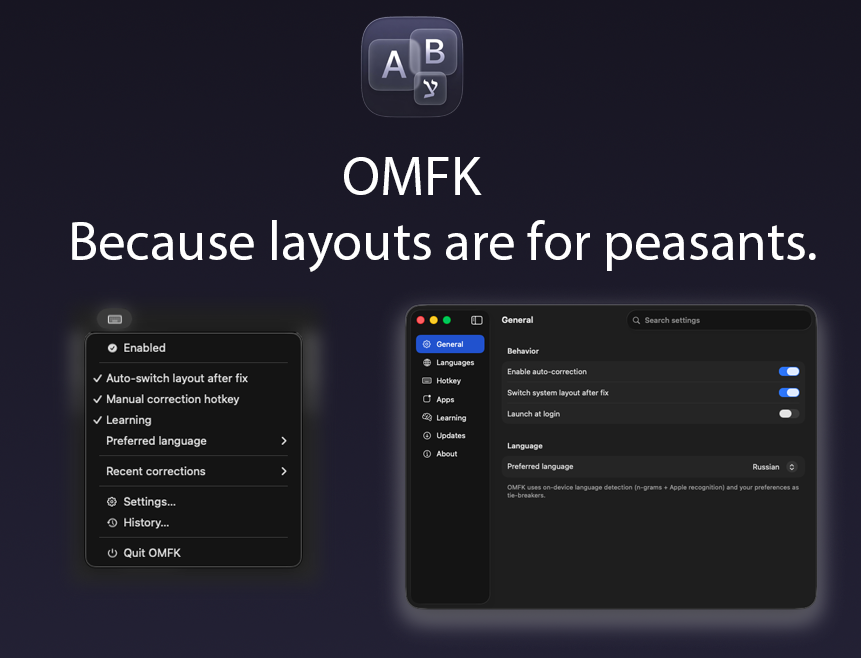
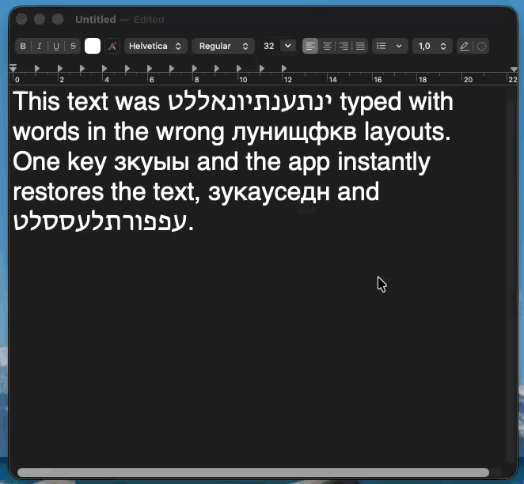

<div align="center">

# O.M.F.K

### AI-powered keyboard layout corrector for macOS



<details>
<summary>See how it works</summary>



</details>

**[Website](https://hireex.ai/omfk)** · **[Download](https://github.com/chernistry/omfk/releases/latest)**

[](https://www.apple.com/macos/)
[](LICENSE)

🇺🇸 English · 🇷🇺 Russian · 🇮🇱 **Hebrew**

> **📦 This is the source code repository.**  
> For pre-built installers, go to [chernistry/omfk](https://github.com/chernistry/omfk/releases/latest).

> **🔒 Why source code is public:**  
> OMFK monitors keyboard input - a sensitive area. This repository provides full transparency so you can verify the app doesn't collect or transmit any data. Everything runs 100% on-device.
> 
> **Note:** Pre-trained model weights and training data are not included. To use OMFK, download the pre-built installer from the [releases repository](https://github.com/chernistry/omfk/releases/latest).

</div>

---

## The Problem

You're typing, deep in thought... then you look up:

```
Ghbdtn, rfr ltkf?   →   Привет, как дела?
руддщ цщкдв          →   hello world
akuo                 →   שלום
```

Wrong keyboard layout. Again.

**OMFK fixes this automatically, as you type.**

---

## ✨ Key Features

<table>
<tr>
<td width="50%">

**🚀 Type without thinking**

Just type. OMFK detects wrong layouts on word boundaries and fixes them instantly. No hotkeys needed.

</td>
<td width="50%">

**🧠 Self-learning**

Learns from your corrections. Undo a word twice — OMFK remembers. Use Alt to pick an alternative — OMFK learns your preference.

</td>
</tr>
<tr>
<td>

**🔒 100% on-device**

Everything runs locally. No network calls. No logging. No telemetry. Your keystrokes never leave your Mac.

</td>
<td>

**⚡ Blazing fast**

Native CoreML model with CNN+Transformer ensemble trained on Wikipedia and OpenSubtitles dumps. Detection latency <50ms.

</td>
</tr>
<tr>
<td>

**🇮🇱 Hebrew support**

One of the few correctors that properly handles Hebrew — including QWERTY-based layouts with sofit letters (ץ ך ם ן ף).

</td>
<td>

**🔄 Hotkey cycling**

Press `Option` to cycle through alternatives: original → Russian → English → Hebrew → back.

</td>
</tr>
</table>

---

## Building from Source

```bash
# Clone
git clone https://github.com/chernistry/omfk-src.git
cd omfk-src

# Build and run (debug)
./omfk.sh run

# Build release
./omfk.sh release build --version X.Y
```

### Requirements

- macOS 13.0+
- Xcode 15+ / Swift 5.9+
- Python 3.10+ (for training tools)

### Project Structure

```
OMFK/
├── Sources/
│   ├── App/           # Entry point, menu bar
│   ├── Core/          # Layout detection, correction engine
│   ├── Engine/        # Event monitoring, key handling
│   ├── Settings/      # User preferences
│   ├── UI/            # SwiftUI views
│   └── Resources/     # Lexicons (model weights not included)
├── Tools/
│   ├── CoreMLTrainer/ # CNN+Transformer training
│   └── NgramTrainer/  # N-gram language models
└── releases/          # Build scripts
```

> **Note:** Pre-trained model weights (`LayoutClassifier.mlmodel`) are not included in this repository.

---

## Usage

| Action | How |
|--------|-----|
| Toggle auto-correction | Click menu bar icon |
| Cycle through alternatives | Press `Option` |
| Undo last correction | Press `Option` immediately after |
| Exclude an app | Settings → Per-App Rules |
| Manage learned words | Settings → Dictionary |

---

## Known Limitations

- **Sublime Text:** Alt cycling may insert text instead of replacing (app-specific behavior)
- **Some terminal emulators:** May require clipboard fallback mode

---

## License

**Source Available — Non-Commercial**

You may view, study, and modify this code for personal, educational, or research purposes only.

**You may NOT:**
- Use this software or derivatives commercially
- Sell, sublicense, or distribute for profit
- Offer as a service (SaaS)
- Include in commercial products

See [LICENSE](LICENSE) for full terms.

---

<div align="center">

[Website](https://hireex.ai/omfk) · [Download](https://github.com/chernistry/omfk/releases/latest) · [Issues](https://github.com/chernistry/omfk-src/issues)

Made by [Alex Chernysh](https://hireex.ai)

</div>
